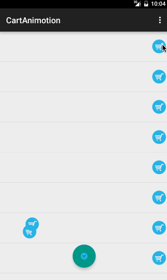

# cart-anim
购物车动画 - 贝塞尔曲线形式



## 使用

```groovy
repositories {
  //...
  maven { url 'http://maven.mjtown.cn/' }
}

dependencies{
  compile 'name.zeno:cart-anim:1.0.0';
}
```

#### api

```java
public class CartAnimView{
  setAnimLayout(@LayoutRes int layout);
  setCartView(View cartView);
  startAnim();
}
```

#### activity_main.xml

```xml
<FrameLayout
  xmlns:android="http://schemas.android.com/apk/res/android"
  xmlns:tools="http://schemas.android.com/tools"
  android:layout_width="match_parent"
  android:layout_height="match_parent"
  tools:context=".MainActivity"
  >

  <android.support.v7.widget.RecyclerView
    android:id="@+id/rcv_cart"
    android:layout_width="match_parent"
    android:layout_height="match_parent"
    android:text="@string/hello_world"
    />

  <zeno.name.animcart.CartAnimView
    android:id="@+id/anim_container"
    android:layout_width="match_parent"
    android:layout_height="match_parent"
    />

  <android.support.design.widget.FloatingActionButton
    android:id="@+id/fab"
    android:layout_width="wrap_content"
    android:layout_height="wrap_content"
    android:layout_gravity="bottom|center_horizontal"
    android:layout_marginBottom="32dp"
    android:src="@drawable/ic_cart"
    />

</FrameLayout>
```

cart_anim.xml

```xml
<?xml version="1.0" encoding="utf-8"?>
<ImageView xmlns:android="http://schemas.android.com/apk/res/android"
           android:layout_width="wrap_content"
           android:layout_height="wrap_content"
           android:orientation="vertical"
           android:src="@drawable/ic_cart"
    />
 ```

 MainActivity.java

 ```java
 package name.zeno.cartanimotion.demo;

 import android.os.Bundle;
 import android.support.annotation.NonNull;
 import android.support.design.widget.FloatingActionButton;
 import android.support.v7.app.AppCompatActivity;
 import android.support.v7.widget.LinearLayoutManager;
 import android.support.v7.widget.RecyclerView;
 import android.view.Menu;
 import android.view.MenuItem;
 import android.view.View;

 import java.util.ArrayList;
 import java.util.List;

 import butterknife.Bind;
 import butterknife.ButterKnife;
 import kale.adapter.CommonRcvAdapter;
 import kale.adapter.item.AdapterItem;
 import zeno.name.animcart.CartAnimView;

 /**
  * @author 陈治谋 (513500085@qq.com)
  */
 public class MainActivity extends AppCompatActivity
 {
   @Bind(R.id.rcv_cart)       RecyclerView         rcvCart;
   @Bind(R.id.anim_container) CartAnimView         cartAnimView;
   @Bind(R.id.fab)            FloatingActionButton fab;
   private                    Action1<View>        listener;


   @Override public boolean onCreateOptionsMenu(Menu menu)
   {
     getMenuInflater().inflate(R.menu.menu_main, menu);
     return true;
   }

   @Override public boolean onOptionsItemSelected(MenuItem item)
   {
     switch (item.getItemId()) {
       case R.id.action_set_fab:
         cartAnimView.setCartView(fab);
         break;
       case R.id.action_set_null:
         cartAnimView.setCartView(null);
         break;
     }
     return true;
   }

   @Override
   protected void onCreate(Bundle savedInstanceState)
   {
     super.onCreate(savedInstanceState);
     setContentView(R.layout.activity_main);
     ButterKnife.bind(this);
     cartAnimView.setAnimLayout(R.layout.cart_anim);
     cartAnimView.setCartView(fab);
     listener = cartAnimView::startAnim;
     CommonRcvAdapter<Object> adapter = new CommonRcvAdapter<Object>(null)
     {
       @NonNull @Override public AdapterItem createItem(Object o)
       {
         CartItem item = new CartItem();
         item.setOnClickCartListener(listener);
         return item;
       }
     };
     rcvCart.setLayoutManager(new LinearLayoutManager(this));
     rcvCart.setAdapter(adapter);
     List<Object> data = new ArrayList<>();
     for (int i = 0; i < 20; i++) {
       data.add(new Object());
     }
     adapter.setData(data);
     adapter.notifyDataSetChanged();
   }
 }
 ```
